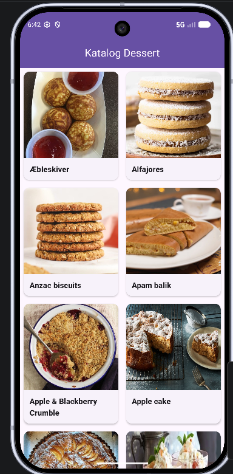

# Katalog-Dessert

## Informasi Mahasiswa
- **Nama**  : Muhammad Zhofran
- **NIM**   : 2410501068
- **Kelas** : B

## Deskripsi
Aplikasi Android native berbasis Java yang menampilkan katalog makanan penutup (dessert) dari API publik [TheMealDB](https://www.themealdb.com/). Aplikasi ini mengambil data secara real-time menggunakan Volley, menampilkan daftar dessert dalam tampilan grid, dan menyediakan halaman detail lengkap dengan foto dan instruksi memasak.

## Dependencies Utama
- androidx.appcompat
- com.google.android.material
- androidx.constraintlayout
- androidx.swiperefreshlayout
- com.android.volley
- com.github.bumptech.glide

## Fitur yang Dikembangkan
- Menampilkan daftar dessert dari API TheMealDB dalam format **Grid RecyclerView**
- **Responsive layout**: 2 kolom saat portrait, 4 kolom saat landscape
- **Swipe to Refresh** untuk memuat ulang data dari API
- Halaman **Detail Dessert** yang menampilkan nama, foto, dan instruksi memasak
- Loading indicator (ProgressBar) saat data sedang dimuat
- Penanganan error koneksi dengan pesan Toast
- Menggunakan **ViewBinding** untuk binding tampilan
- Menggunakan **Glide** untuk memuat gambar dari URL secara efisien
- Material 3 Toolbar dengan navigasi back pada halaman detail

## Screenshot Preview
<p>
  
</p>

## API yang Digunakan
- **List Dessert**: `https://www.themealdb.com/api/json/v1/1/filter.php?c=Dessert`
- **Detail Dessert**: `https://www.themealdb.com/api/json/v1/1/lookup.php?i={idMeal}`

## Cara Menjalankan
Aplikasi ini menggunakan Android Studio dengan Gradle.

### 1. Clone Repository
```bash
git clone https://github.com/Zhofran27/Katalog-Dessert.git
```

### 2. Masuk Ke Folder Project
```bash
cd Katalog-Dessert
```

### 3. Buka di Android Studio
Buka Android Studio → **Open** → pilih folder project.

### 4. Sync Gradle
Tunggu Android Studio selesai melakukan **Gradle Sync** secara otomatis.

### 5. Jalankan Aplikasi
Klik tombol **Run** ▶ atau gunakan shortcut `Shift + F10`, lalu pilih emulator atau perangkat fisik.

> **Catatan:** Pastikan perangkat/emulator terhubung ke internet agar data dari API dapat dimuat.


